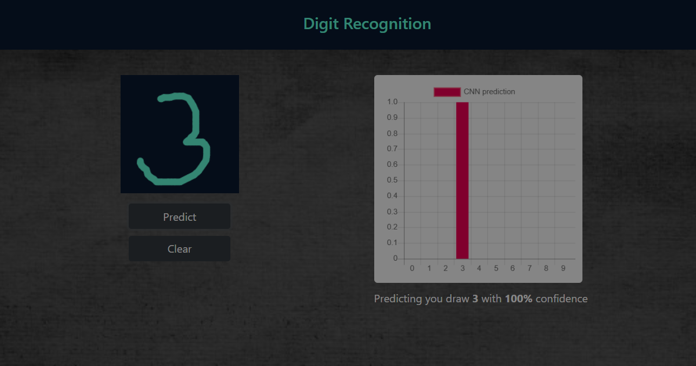
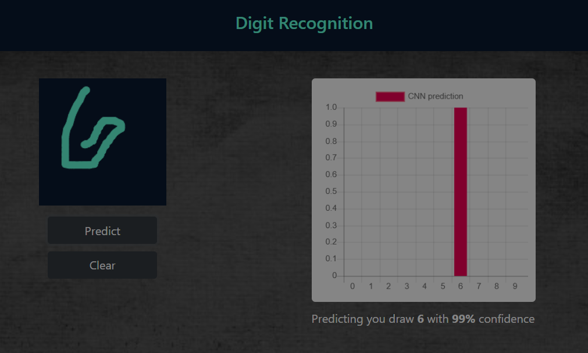

# MNIST Digital Classification and Handwritten Digit Recognition

A web-based application for real-time handwritten digit recognition using a Convolutional Neural Network (CNN) and Support Vector Machine (SVM) trained on the MNIST dataset. This project demonstrates the power of machine learning in digit recognition with an interactive web interface.

## 🌐 Live Demo

**Try the application online:** [MNIST Digital Classification and Handwritten Digit Recognition](https://vinaykumar939.github.io/MNIST-Digital-Classification-and-Handwritten-Digit-Recognition/)

## 🎯 Project Overview

This project combines the MNIST dataset with a deep learning model to create an interactive web application where users can draw digits on a canvas and get real-time predictions.

## ✨ Features

- **Interactive Drawing Canvas**: Draw digits using mouse or touch input
- **Real-time Prediction**: Instant digit recognition with confidence scores
- **Visual Results**: Bar chart visualization of prediction probabilities
- **Responsive Design**: Works on desktop and mobile devices
- **Pre-trained Model**: Includes a trained CNN model ready for use
- **Modern UI**: Clean, responsive interface with Bootstrap styling

## 🖼️ Sample Output

Below are sample outputs from the application:

**Prediction for digit 3:**



**Prediction for digit 6:**




## 🏗️ Project Structure

```
├── index.html              # Main HTML file
├── MNIST.py               # Python script for model training
├── models/                # Pre-trained model files
│   ├── model.json         # Model architecture
│   └── group1-shard*.bin  # Model weights
├── js/
│   ├── digit-recognition.js  # Main JavaScript logic
│   └── chart.min.js          # Chart.js library
├── style/
│   └── digit.css             # Custom CSS styles
└── images/                   # Background images and favicons
```

## 🚀 Quick Start

### Option 1: Use Pre-trained Model (Recommended)

1. **Clone the repository**

   ```bash
   git clone https://github.com/VinayKumar939/MNIST-Digital-Classification-and-Handwritten-Digit-Recognition.git
   cd MNIST-Digital-Classification-and-Handwritten-Digit-Recognition
   ```

2. **Open the application**

   - Simply open `index.html` in your web browser
   - Or serve the files using a local web server:

     ```bash
     # Using Python
     python -m http.server 8000

     # Using Node.js
     npx serve .
     ```

3. **Start recognizing digits**
   - Draw a digit (0-9) on the canvas
   - Click "Predict" to see the result
   - Use "Clear" to reset the canvas

### Option 2: Train Your Own Model

1. **Install Python dependencies**

   ```bash
   pip install tensorflow tensorflowjs
   ```

2. **Train the model**

   ```bash
   python MNIST.py
   ```

3. **Use the newly trained model**
   - The trained model will be saved in the `models/` directory
   - Open `index.html` to use your custom model

## 🧠 Model Architecture

The CNN model used in this project consists of:

- **Input Layer**: 28x28x1 grayscale images
- **Convolutional Layers**:
  - Conv2D(32, 5x5) with same padding
  - Conv2D(64, 5x5) with same padding
- **Pooling Layers**: MaxPool2D(2x2) after each conv layer
- **Dense Layers**:
  - Dense(1024) with ReLU activation
  - Dropout(0.2) for regularization
  - Dense(10) with softmax activation (output layer)

## 🛠️ Technologies Used

- **Frontend**: HTML5, CSS3, JavaScript (ES6+)
- **Machine Learning**: TensorFlow.js, TensorFlow/Keras
- **UI Framework**: Bootstrap 4
- **Charts**: Chart.js
- **Styling**: Custom CSS with responsive design

## 📱 Browser Compatibility

- Chrome (recommended)
- Firefox
- Safari
- Edge
- Mobile browsers (iOS Safari, Chrome Mobile)

## 🎨 Customization

### Styling

Modify `style/digit.css` to customize the appearance:

- Canvas colors and dimensions
- Background images
- Button styles
- Responsive breakpoints

### Model Parameters

Edit `MNIST.py` to adjust:

- Model architecture
- Training epochs
- Learning rate
- Data preprocessing

## 📊 Performance

- **Training Accuracy**: ~95% on MNIST test set
- **Inference Speed**: Real-time predictions
- **Model Size**: ~16MB (compressed)
- **Browser Memory**: Low footprint

## 📝 License

This project is open source and available under the [MIT License](LICENSE).
